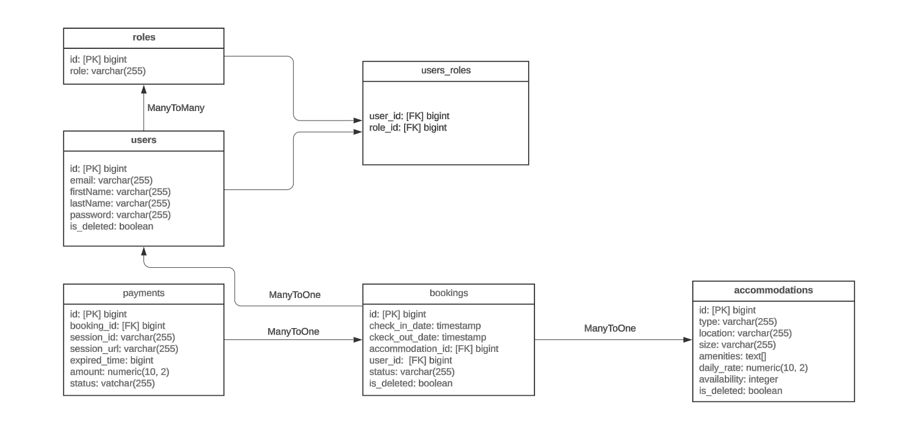

# Ebooking API 🗓️
Welcome to the Ebooking API, a RESTful API designed for managing a booking service. It allows users to view accommodations, make reservations, pay for them, and supports user registration and authentication via JWT. The API also includes role-based access control, which provides different levels of access for users and administrators.
## Features
### Users 👥
- User registration and login.
- JWT-based authentication.
- User roles: USER, GOLD_USER, PRIVILEGED_USER and ADMIN (administrator).
### Accommodation 📚 
- CRUD operations for accommodation: create, read, update, and delete.
- Filter accommodations by categories.
- Search accommodations by title or author.
- Users can only perform GET operations
- Administrator can perform POST, PUT, DELETE operations
### Booking 📂
- All actions are performed only by authenticated users.
- Users can create reservations, view all their reservations, or reservations by id.
- Users can modify, cancel and delete their bookings..
- Admins can search by booking filters or view all and change status
- There is a scheduled hourly check for sold-out reservation
### Payment 🛒
- Users can create a payment based on a booking.
- The payment can be successful or not.
- If a payment is initiated but not completed, it may be exhausted, then the user may renewpayment
### Notification 📋
- Notifications are sent to the Telegram bot for the admin.
- Notifications about about actions of accommodations, bookings and payments.
## Getting Started 🚀
### Setup
1. **Clone the repository:**
```
git clone https://github.com/vladshender/Online-Book-Store.git
```
2. **Сreate an environment of variables**<br>

Create file .env by copying the content from file .env.sample and fill in the fields.

3. **Build the project:**
```
mvn clean package
```
4. **Build the project:**
```
docker build -t name_image_your_app
```
5. **Start the application using Docker Compose:**
```
docker-compose up
```
### Connecting to a Custom Database 🗄
To connect to a custom PostgreSQL database, update the application.properties file with your database details:
```
spring.config.import=optional:file:.env[.properties]
spring.datasource.url=jdbc:postgresql://<YOUR_DB_HOST>:<YOUR_DB_PORT>/<YOUR_DB_NAME>?currentSchema=<YOUR_DB_SCHEMA>
spring.datasource.username=<YOUR_DB_USERNAME>
spring.datasource.password=<YOUR_DB_PASSWORD>
spring.datasource.driver-class-name=org.postgresql.Driver
spring.jpa.hibernate.ddl-auto=validate
spring.jpa.show-sql=true
server.servlet.context-path=/api

jwt.expiration=<TIME_SESSION_EXPERATION_IN_MS>
jwt.secret=<SECRET_WORD>

bot.name=${BOT_NAME}
bot.key=${BOT_KEY}

stripe.secretKey=${STRIPE_SECRET_KEY}
```
### You can explore the api through the Swagger UI:
```
http://localhost:8088/api/swagger-ui/index.html
```
## Endpoints
### Authentication

| Method          | Endpoint   |          Role         |     Description                         |
|-----------------|------------|-----------------------|-----------------------------------------|
|  `POST`          | `api/auth/login`       | Unauthorized       |  Login user                          | 
| `POST`         | `api/auth/registration`  | Unauthorized      |    Registration user with password and email  | 
### API Authentication Guide
<details>
  <summary><h4><strong>api/auth/login</strong></h4></summary>

  <strong>Request Body</strong>
  <pre>
  {
      "email": "example@example.com",
      "password": "password123"
  }
  </pre>  

  <strong>Response Body</strong>
  <pre>
{
  "token":"JWT-Token"
}    
  </pre>
</details>

<details>
  <summary><h4><strong>api/auth/registration</strong></h4></summary>

  <strong>Request Body</strong>
  <pre>
  {
      "email": "example@example.com",
      "password": "password123",
      "repeatPassword": "password123",
      "firstName": "Ivan",
      "lastName": "Ivanenko"
  }
  </pre>

  <strong>Response Body</strong>
  <pre>
  {
      "id": 4,
      "email": "example@example.com",
      "firstName": "Ivan",
      "lastName": "Ivanenko",
      "roles": [
        "ROLE_USER"
    ]
  }
  </pre>
</details>

### User
| Method          | Endpoint   |          Role         |     Description                         | 
|-----------------|------------|-----------------------|-----------------------------------------|
|  `GET`          | `api/users/me`       | USER             |   Get data by user  |
| `PUT`         | `api/users/me`         | USER             |    Update user data                          |
| `PUT`        | `api/users/password/me` | USER             |    Update a password by user                     |
| `PUT`      | `api/users/{id}/role`     | ADMIN            |     Update user`s role by user id                 |
### API User Guide
<details>
  <summary><h4><strong>GET api/users/me</strong></h4></summary>
  <strong>Request Body</strong>
  <pre>
    missing
  </pre>
  <strong>Response Body</strong>
  <pre>
  {
    "id": 2,
    "email": "bob@example.com",
    "firstName": "Bob",
    "lastName": "User",
    "roles": [
        "ROLE_PRIVILEGED_USER"
    ]
  }
  </pre>
</details>

<details>
  <summary><h4><strong>PUT api/users/me</strong></h4></summary>
    <strong>Request Body</strong>
  <pre>
{
    "email": "bob@example.com",
    "firstName": "Bob",
    "lastName": "LastName"
}
  </pre>
  <strong>Response Body</strong>
  <pre>
{
    "id": 2,
    "email": "bob@example.com",
    "firstName": "Bob",
    "lastName": "LastName",
    "roles": [
        "ROLE_PRIVILEGED_USER"
    ]
}
  </pre>
</details>
<details>
  <summary><h4><strong>PUT api/users/me/password</strong></h4></summary>
  <strong>Request Body</strong>
  <pre>
{
    "password":"user1234",
    "repeatPassword":"user1234"
}
  </pre>  

  <strong>Response Body</strong>
  <pre>
  Your password has been updated
  </pre>
</details>

<details>
  <summary><h4><strong>PUT api/users/{id}/role</strong></h4></summary>
  <strong>Request Body</strong>
  <pre>
{
    "roles":["ROLE_GOLD_USER"]
}
  </pre>
  <strong>Response Body</strong>
  <pre>
{
    "id": 4,
    "email": "john@example.com",
    "firstName": "John",
    "lastName": "User",
    "roles": [
        "ROLE_GOLD_USER"
    ]
}
  </pre>
</details>

### Accommodation
| Method          | Endpoint   |          Role         |     Description                         | 
|-----------------|------------|-----------------------|-----------------------------------------|
|  `GET`          | `api/accommodations/list`   | Non Auth         |   Get all accommodation                          |
| `GET`         | `api/accommodations/{id}`     | USER, ADMIN      |    Get accommodation by id                       |
| `POST`        | `api/accommodations`         | ADMIN             |    Сreate a new accommodation                    |
| `DELETE`      | `api/accommodations/{id}`    | ADMIN            |     Delete a accommodation by id                  |
| `PUT`         |  `api/accommodations/{id}`   | ADMIN            |     Update accommodation by id                    |
### API Accommodation Guide
<details>
  <summary><h4><strong>GET api/accommodations/list</strong></h4></summary>
  <strong>Request Body</strong>
  <pre>
    missing
  </pre>
  <strong>Response Body</strong>
  <pre>
{
    "id": 1,
    "type": "HOUSE",
    "location": "23, 17 Ovruch",
    "size": "2level",
    "amenities": [
        "WiFi"
    ],
    "dailyRate": 150,
    "availability": 1
}
  </pre>
</details>

<details>
  <summary><h4><strong>GET api/accommodations/{id}</strong></h4></summary>
    <strong>Request Body</strong>
  <pre>
    missing
  </pre>
  <strong>Response Body</strong>
  <pre>
{
    "id": 1,
    "type": "HOUSE",
    "location": "23, 17 Ovruch",
    "size": "2level",
    "amenities": [
        "WiFi"
    ],
    "dailyRate": 150,
    "availability": 1
}
  </pre>
</details>
<details>
  <summary><h4><strong>POST api/accommodations</strong></h4></summary>
  <strong>Request Body</strong>
  <pre>
{
    "type":"HOUSE",
    "location":"23, 17 Ovruch",
    "size":"2level",
    "amenities":["WiFi"],
    "dailyRate":150,
    "availability":1
}
  </pre>  

  <strong>Response Body</strong>
  <pre>
{
    "id": 1,
    "type": "HOUSE",
    "location": "23, 17 Ovruch",
    "size": "2level",
    "amenities": [
        "WiFi"
    ],
    "dailyRate": 150,
    "availability": 1
}
  </pre>
</details>

<details>
  <summary><h4><strong>DELETE api/accommodations/{id}</strong></h4></summary>
  <strong>Request Body</strong>
  <pre>
    missing
  </pre>
  <strong>Response Body</strong>
  <pre>
    missing
  </pre>
</details>

<details>
  <summary><h4><strong>PUT api/accommodations/{id}</strong></h4></summary>

  <strong>Request Body</strong>
  <pre>
{
    "type":"HOUSE",
    "location":"23, 18 Ovruch",
    "size":"2level",
    "amenities":["WiFi"],
    "dailyRate":350,
    "availability":1
}
  </pre>  

  <strong>Response Body</strong>
  <pre>
{
    "id": 1,
    "type": "HOUSE",
    "location": "23, 18 Ovruch",
    "size": "2level",
    "amenities": [
        "WiFi"
    ],
    "dailyRate": 350,
    "availability": 1
}
  </pre>
</details>

### Booking
| Method          | Endpoint   |          Role         |     Description                         | 
|-----------------|------------|-----------------------|-----------------------------------------|
|  `POST`       | `api/bookings/list`           | User              |  Сreate a new reservation         |
| `GET`         | `api/bookings/my`             | User              |    Get all user bookings          |
| `GET`         | `api/bookings/{id}`          | User               |    Get user`s booking by id       |
| `PUT`         | `api/bookings/{id}`          | User              |    Update a user's booking by id   |
| `PUT`         |  `api/bookings/{id}/cancel`   | User              |     Cancel a user`s booking by id |
| `DELETE`      | `api/bookings/{id}`         | User               |    Delete user booking             |
| `GET`         | `api/bookings`              | ADMIN              |     Search for admins with filtering|
| `PUT`         |  `api/bookings/status/{id}`   | ADMIN            |     Update booking status           |
### API Booking Guide
<details>
  <summary><h4><strong>POST api/bookings</strong></h4></summary>
  <strong>Request Body</strong>
  <pre>
{
    "checkInDate": "20-01-2025 14:00:00",
    "checkOutDate": "22-01-2025 14:00:00",
    "accommodationId": 2
}
  </pre>
  <strong>Response Body</strong>
  <pre>
{
    "id": 1,
    "checkInDate": "2025-01-20T14:00:00",
    "checkOutDate": "2025-01-22T14:00:00",
    "accommodationId": 2,
    "userName": "Bob LastName",
    "status": "PENDING"
}
  </pre>
</details>

<details>
  <summary><h4><strong>GET api/bookings/my</strong></h4></summary>
    <strong>Request Body</strong>
  <pre>
    missing
  </pre>
  <strong>Response Body</strong>
  <pre>
[
    {
        "id": 1,
        "checkInDate": "2025-01-20T14:00:00",
        "checkOutDate": "2025-01-22T14:00:00",
        "accommodationId": 2,
        "userName": "Bob LastName",
        "status": "PENDING"
    }
]
  </pre>
</details>
<details>
  <summary><h4><strong>GET api/bookings/{id}</strong></h4></summary>
  <strong>Request Body</strong>
  <pre>
    missing
  </pre>  

  <strong>Response Body</strong>
  <pre>
{
    "id": 1,
    "checkInDate": "2025-01-20T14:00:00",
    "checkOutDate": "2025-01-22T14:00:00",
    "accommodationId": 2,
    "userName": "Bob LastName",
    "status": "PENDING"
}
  </pre>
</details>

<details>
  <summary><h4><strong>PUT api/bookings/{id}</strong></h4></summary>
  <strong>Request Body</strong>
  <pre>
{
    "checkInDate": "20-01-2025 14:00:00",
    "checkOutDate": "21-01-2025 11:00:00",
    "accommodationId": 2
}
  </pre>
  <strong>Response Body</strong>
  <pre>
{
    "id": 1,
    "checkInDate": "2025-01-20T14:00:00",
    "checkOutDate": "2025-01-21T11:00:00",
    "accommodationId": 2,
    "userName": "Bob LastName",
    "status": "PENDING"
}
  </pre>
</details>

<details>
  <summary><h4><strong>PUT api/bookings/{id}/cancel</strong></h4></summary>

  <strong>Request Body</strong>
  <pre>
    missing
  </pre>  

  <strong>Response Body</strong>
  <pre>
    missing
  </pre>
</details>

<details>
  <summary><h4><strong>DELETE api/bookings/{id}</strong></h4></summary>

  <strong>Request Body</strong>
  <pre>
    missing
  </pre>  

  <strong>Response Body</strong>
  <pre>
    missing
  </pre>
</details>

<details>
  <summary><h4><strong>GET api/bookings</strong></h4></summary>

  <strong>Request Param</strong>
  <pre>
    nothing
    statusArray
    statusIdArray
  </pre>  

  <strong>Response Body</strong>
  <pre>
[
    {
        "id": 1,
        "checkInDate": "2025-01-20T14:00:00",
        "checkOutDate": "2025-01-21T11:00:00",
        "accommodationId": 2,
        "userName": "Bob LastName",
        "status": "CANCELED"
    }
]
  </pre>
</details>

<details>
  <summary><h4><strong>PUT api/bookings/status/{id}</strong></h4></summary>

  <strong>Request Param</strong>
  <pre>
{
    "status":"EXPIRED"
}
  </pre>  

  <strong>Response Body</strong>
  <pre>
{
    "id": 1,
    "checkInDate": "2025-01-20T14:00:00",
    "checkOutDate": "2025-01-21T11:00:00",
    "accommodationId": 2,
    "userName": "Bob LastName",
    "status": "EXPIRED"
}
  </pre>
</details>

### Payment
| Method          | Endpoint   |          Role         |     Description                         | 
|-----------------|------------|-----------------------|-----------------------------------------|
|  `GET`          | `api/payments/user`         | User           |   Get all payments for the user         |
| `GET`         | `api/payments/all`           | ADMIN          |    Get all payments                      |
| `POST`        | `api/payments/session`       | User             |  Create a new payment session            |
| `GET`          | `api/payments/success`       | User            |   Successful payment endpoint          |
| `GET`         |  `api/payments/cancel`        | User            |  Cancelful payment endpoint            |
| `POST`         |  `api/payments/{id}/renew`   | User            |  Renew payment session         |
### API Payment Guide
<details>
  <summary><h4><strong>GET api/payments/user</strong></h4></summary>
  <strong>Request Body</strong>
  <pre>
    missing
  </pre>
  <strong>Response Body</strong>
  <pre>
[
    {
        "id": 1,
        "bookingId": 2,
        "sessionId": "session_id",
        "sessionUrl": "session_url",
        "amount": 150.00,
        "status": "PENDING"
    },
    {
        "id": 2,
        "bookingId": 2,
        "sessionId": "session_id",
        "sessionUrl": "session_url",
        "amount": 150.00,
        "status": "PAID"
    }
]
  </pre>
</details>

<details>
  <summary><h4><strong>GET api/payments/all</strong></h4></summary>
    <strong>Request Body</strong>
  <pre>
    missing
  </pre>
  <strong>Response Body</strong>
  <pre>
[
    {
        "id": 1,
        "bookingId": 2,
        "sessionId": "session_id",
        "sessionUrl": "session_url",
        "amount": 150.00,
        "status": "PENDING"
    },
    {
        "id": 2,
        "bookingId": 2,
        "sessionId": "session_id",
        "sessionUrl": "session_url",
        "amount": 150.00,
        "status": "PAID"
    }
]
  </pre>
</details>

<details>
  <summary><h4><strong>POST api/payments/session</strong></h4></summary>
  <strong>Request Param</strong>
  <pre>
  bookingId
  </pre>  

  <strong>Response Body</strong>
  <pre>
{
    "sessionUrl": "session_url",
    "amount": 150.00,
    "status": "PENDING"
}
  </pre>
</details>

<details>
  <summary><h4><strong>GET api/payments/success</strong></h4></summary>
  <strong>Request Body</strong>
  <pre>
    missing
  </pre>
  <strong>Response Body</strong>
  <pre>
{
  "bookingId": 1,
  "status": "PAID",
  "amount": 150
}
  </pre>
</details>

<details>
  <summary><h4><strong>GET api/payments/cancel</strong></h4></summary>

  <strong>Request Body</strong>
  <pre>
missing
  </pre>  

  <strong>Response Body</strong>
  <pre>
{
    "id": 1,
    "checkInDate": "2025-01-20T14:00:00",
    "checkOutDate": "2025-01-21T11:00:00",
    "accommodationId": 2,
    "userName": "Bob LastName",
    "status": "EXPIRED"
}
  </pre>
</details>

<details>
  <summary><h4><strong>POST api/payments/{session_id}/renew</strong></h4></summary>

  <strong>Request Body</strong>
  <pre>
missing
  </pre>  

  <strong>Response Body</strong>
  <pre>
{
    "sessionUrl": "session_url",
    "amount": 150.00,
    "status": "PENDING"
}
  </pre>
</details>

## Schema of tables and relationships between models

##
The Ebooking API provides a robust foundation for managing users, bookings, accommodations, and payments. The technology stack provides scalability, security and ease of maintenance. Feel free to contribute or provide feedback to help us improve.
